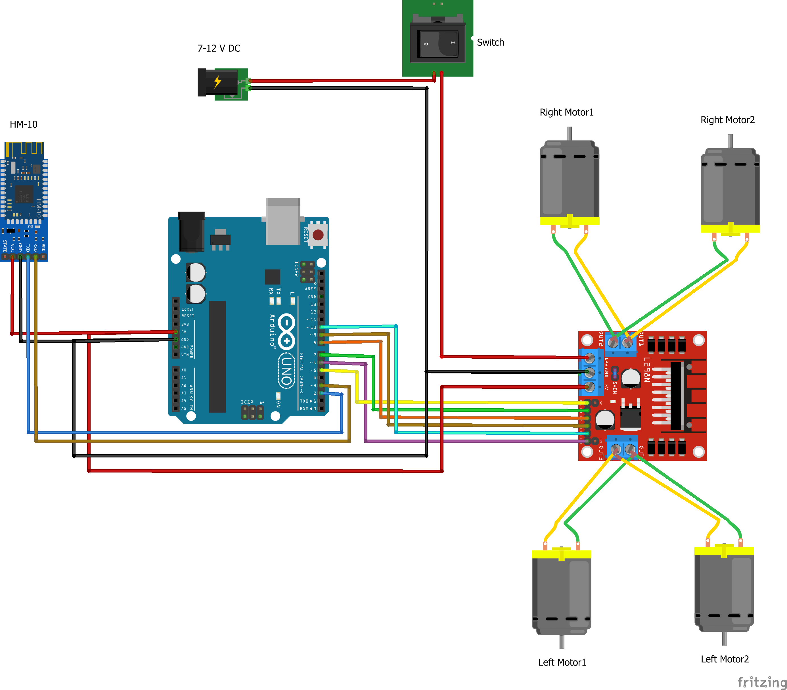

# Arduino-Bluetooth-RC-Car

[](https://www.arduino.cc/)
[](#)
[](#)
[](https://github.com/iPranjalDas)

🚗 4WD Bluetooth-controlled autonomous obstacle-avoidance robot car with HC-05 & HC-SR04 sonar radar.

---

## 🖥️ System Architecture & Visual Wiring Layout

### 🔌 Graphical Schematic & Pinout Diagrams




```
┌── ARDUINO BLUETOOTH & RADAR CAR WIRING ─────────────────────────────────┐
│                                                                         │
│   [HC-SR04 Sonar]                [HC-05 Bluetooth]                      │
│   VCC ───> 5V                    VCC ───> 5V                            │
│   GND ───> GND                   GND ───> GND                           │
│   Trig ──> Pin 12                TXD ───> Pin 2 (SoftSerial RX)         │
│   Echo ──> Pin 11                RXD ───> Pin 3 via 1k/2k divider       │
│                                                                         │
│          ┌──────────────────────────────────────────┐                   │
│          │             ARDUINO UNO R3               │                   │
│          └──────────────────────────────────────────┘                   │
│                    │                     │                              │
│                    ▼                     ▼                              │
│             [L298N Motor Driver]   [SG90 Radar Servo]                   │
│             IN1-IN4 ──> Pins 5-8   Signal ──> Pin 9                     │
│             ENA,ENB ──> PWM 6,10   Power  ──> 5V External               │
│             OUT1-4  ──> 4x DC TT Motors                                 │
└─────────────────────────────────────────────────────────────────────────┘
```

---

## 🛠️ Hardware Requirements & Components

- **Microcontroller / Core:** Arduino Uno / ESP32 / NodeMCU (Refer to `.ino` sketch)
- **Power Supply:** 5V / 12V external regulated battery pack
- **Sensors & Actuators:** Detailed in circuit diagram and sketch pinout headers

---

## 🚀 Installation & Upload

1. Clone this repository:
   ```bash
   git clone https://github.com/iPranjalDas/Arduino-Bluetooth-RC-Car.git
   ```
2. Open the primary `.ino` sketch in the [Arduino IDE](https://www.arduino.cc/en/software).
3. Install required libraries via the Arduino Library Manager.
4. If this sketch uses Wi-Fi, update `YOUR_WIFI_SSID` and `YOUR_WIFI_PASSWORD` with your local network settings.
5. Select your target board and COM port, then click **Upload**.

---

## 🔒 Security & Privacy Notice
All source sketches have been thoroughly sanitized. Generic placeholder strings are used for network credentials and API tokens.

---

## 📄 License
This project is licensed under the MIT License - see the [LICENSE](LICENSE) file for details.  
Copyright (c) 2026 Pranjal Das. All Rights Reserved.

---

## 👤 Author & Architecture
**Pranjal Das**  
- **GitHub:** [@iPranjalDas](https://github.com/iPranjalDas)
- **Projects:** [https://iPranjalDas.github.io/Projects/](https://iPranjalDas.github.io/Projects/)
